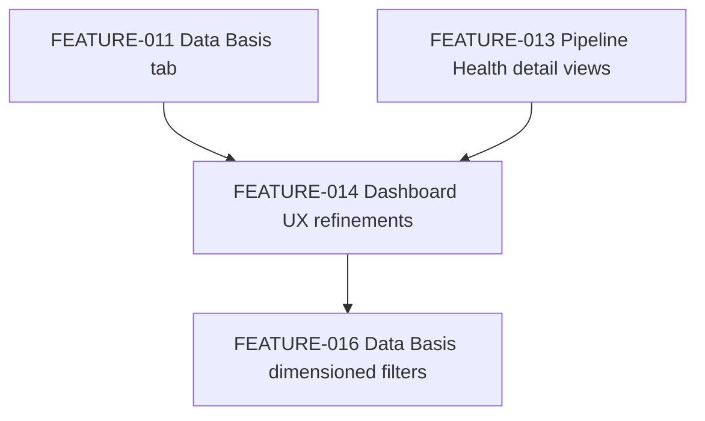

# FEATURE-014 — Dashboard UX refinements: health thresholds, trend counts, population dropdown, footer cleanup, Data Basis shared filter-bar

**Status:** 🟢 Implemented (pending PR/review) · **Effort:** M–L (~22.5 h) · **Priority:** Medium
**Branch root:** `feature/dashboard-ux-refinements` · **Created:** 2026-07-19 · **Updated:** 2026-07-19

> **Implementation note (2026-07-19, `@implementer`):** all 12 tasks in
> [FEATURE-014-technical-plan.yaml](technical/FEATURE-014-technical-plan.yaml) are implemented,
> tested, and merged locally into `main` (one task per branch, TDD RED→GREEN, one commit per task).
> Full backend suite: 266 passed, 3 skipped. Full frontend suite: 308 passed. Coverage on all
> changed backend modules is 95–100%. `python dev/tools/validate_workflow.py` passes (only a
> pre-existing, unrelated warning about the untracked FEATURE-015 stray files). Nothing has been
> pushed to `origin` or deployed — this is local-only, ready for review before any PR/deploy.
**Reviewed:** 2026-07-19 by `@reviewer` — see [REVIEW-FEATURE-014.md](../reviews/REVIEW-FEATURE-014.md)

> Authored by `@architect` from five verbatim, project-owner-requested dashboard changes. Note on
> numbering: `dev/plans/FEATURE-015-idealista-web-scraper.md`,
> `dev/plans/technical/FEATURE-015-technical-plan.yaml`, and `dev/reviews/REVIEW-FEATURE-015.md` are
> **untracked, stray placeholder files from an unrelated session** — confirmed via `git status` and
> `git ls-files`. The last real, committed feature is FEATURE-013 (`dev/plans/README.md` line 22),
> so this is correctly **FEATURE-014**. No file belonging to the stray `FEATURE-015` set is touched
> by this plan or its tasks.
>
> **Reviewer split note:** the reviewer moved the architect's original Phase 5a/5b/5d (backend
> district/neighbourhood dimensions on 4 Data Basis datasets, additive `data_basis_relevant`
> population split, and the matching frontend histogram re-aggregation adapters) into a follow-up
> feature — see [FEATURE-016-data-basis-dimensioned-filters.md](FEATURE-016-data-basis-dimensioned-filters.md).
> The next free number is **FEATURE-016**, not FEATURE-015, because FEATURE-015 is already occupied
> by the stray, untracked idealista-scraper files noted above. This feature (FEATURE-014) now ships
> Phase 5c (shared filter-bar UI) plus district/neighbourhood filtering of `listing-locations-map`
> only, exactly as the architect's own fallback proposed. See the Reviewer's rationale in
> [REVIEW-FEATURE-014.md](../reviews/REVIEW-FEATURE-014.md).

## Objective

Ship five independent, small-to-medium dashboard/pipeline-health UX fixes the project owner asked
for in one sitting. They share no code path except the frontend filter/i18n/chart-renderer
conventions already established by FEATURE-009/011/013, so this plan treats them as five ordered
work items inside one feature rather than one monolithic change:

1. Tighten the Pipeline Health "execution duration" Ampel thresholds from 5 min/10 min to 60 s/120 s
   (backend constant + i18n caption, all 5 locales).
2. Give the Data Basis tab the same population/district/neighbourhood filter UI as Trend Analysis
   (shared filter-bar), and make `listing-locations-map` — the one Data Basis chart that already
   carries district/neighbourhood dimensions — respect it. **Reviewer decision:** filtering the
   other 4 Data Basis charts (which require new backend dimensions) is deferred to
   [FEATURE-016](FEATURE-016-data-basis-dimensioned-filters.md); see "Open questions & risks" below.
3. Add two new Trend Analysis charts: listing count per Neighbourhood over time, and listing count
   per District over time.
4. Convert the Trend Analysis "Population:" toggle from two always-visible radio buttons into a
   `<details>`/dropdown control matching the Districts/Neighborhoods dropdowns.
5. Remove the dead `<footer>` "Data last updated: —" span, which is never written to and duplicates
   the `#kpi-row` "Last updated" KPI card.

## Context

The dashboard (`frontend/index.html` + `frontend/app.js` + `frontend/src/**`) has three tabs: Trend
Analysis, Data Basis, Pipeline Health. Trend Analysis already has a `.filter-bar` (population toggle
+ district/neighbourhood scope dropdowns, `frontend/src/filters.js`) that Data Basis intentionally
does **not** have — `frontend/app.js` documents this explicitly:

```js
// Data Basis tab renderers — consume the unscoped, unfiltered
// data_basis block directly (never applyScope()'d), so the district/
// neighbourhood/population filters that affect Trend Analysis charts never
// touch these.
const DATA_BASIS_RENDERERS = [ ... ];
```

Backend gold aggregation (`src/etl/data_processing/gold_aggregator.py`) computes `data_basis` **once**,
on the scope-filtered-but-not-population-split DataFrame (`GoldAggregator.build_document()`):

```python
scoped = apply_scope(silver_df)
return {
    ...
    "general": self._run_population(scoped, None, self._general),
    "relevant": self._run_population(scoped, _relevant_rows, self._relevant),
    "data_basis": self._run_data_basis(scoped, self._data_basis),
}
```

Of the 7 `default_data_basis()` strategies, only 2 carry per-listing `district`/`neighborhood`
attribution today (`listing_location_grid_last_3m`, `listing_locations_last_3m` — both back
`listing-locations-map`). The other 4 (`weekly_listing_volume`, `size_histogram_10sqm`,
`rooms_distribution`, `price_per_area_histogram`) group only by `operation` (+ bin/x-value) — no
district/neighbourhood dimension exists in their output rows at all. There is also no `relevant`
variant of `data_basis` — it is computed once, population-agnostic.

`src/etl/pipeline_health/health_checks.py` defines the duration thresholds as plain module
constants used inside `ExecutionDurationCheck._evaluate_one()`:

```python
DURATION_YELLOW_THRESHOLD_SECONDS = 5 * 60
DURATION_RED_THRESHOLD_SECONDS = 10 * 60
...
if max_duration > DURATION_RED_THRESHOLD_SECONDS:
    status = RED
elif max_duration >= DURATION_YELLOW_THRESHOLD_SECONDS:
    status = YELLOW
else:
    status = GREEN
```

`price_time_series_neighborhood` and `price_time_series_district` (both in the `general` population
block only) already carry a `count_listings` field per `(operation, district[, neighborhood],
snapshot_date)` row — a byproduct of the existing groupby-and-aggregate in
`src/etl/data_processing/gold_aggregate.py`. **This means the two new "listing count over time"
charts require zero backend changes** — they are pure new frontend renderers reading a field that
already exists in the shipped JSON.

## Dependencies

- Builds on FEATURE-011 (Data Basis tab), FEATURE-012/013 (Pipeline Health), and the filter/i18n/chart
  conventions from FEATURE-009. No other in-flight feature blocks this one.
- Unblocks [FEATURE-016](FEATURE-016-data-basis-dimensioned-filters.md) (Data Basis district/
  neighbourhood dimensioning): FEATURE-016's frontend wiring assumes the shared filter-bar (this
  feature's Phase 5) already exists.



## Design & patterns

> The Strategy/Adapter design for the backend Data Basis dimensioning and re-aggregation (originally
> described here for item 2) now applies to **FEATURE-016**, not this feature — see
> [FEATURE-016-data-basis-dimensioned-filters.md](FEATURE-016-data-basis-dimensioned-filters.md) for
> that design. What remains in-scope for FEATURE-014 is below.

- **Factory (frontend, item 3):** the two new count-over-time charts are built with the exact
  `makeDistrictRenderer`/`makeNeighborhoodRenderer`-style factory already used by
  `price_time_series_district.js` — same file structure, same `{ id, title, render }` contract, same
  `buildLayout()` theming call. A parallel pure transform (`formatDistrictCountSeries` /
  `formatNeighborhoodCountSeries` in `transforms.js`) mirrors `formatDistrictSeries`/`formatSeries`
  but plots `count_listings` on the Y axis instead of `mean_priceByArea` — kept as separate functions
  (not a parameterised field name) to match the existing convention of one function per chart
  semantic rather than a generic reducer, avoiding over-engineering a one-off need.
- **No new class hierarchy for item 1, 4, 5:** these are constant renames, a markup/CSS change, and
  a deletion — deliberately kept as plain edits, no new abstractions.
- **Shared global filter state, not a second/local Data Basis filter (item 2 — explicit design
  decision, see "Open questions & risks" for the rejected alternative):** the *same* `activePopulation`
  / `selectedDistricts` / `selectedNeighborhoods` module-level state in `frontend/app.js` drives both
  tabs. Concretely: the `.filter-bar` markup is **hoisted out of `#panel-trend-analysis`** into a
  single shared location in `frontend/index.html` (rendered once, above both tab panels, inside
  `<main>`), so there is exactly one set of `#population-toggle`/`#district-filter`/
  `#neighborhood-filter` DOM nodes and exactly one set of change listeners — no ID duplication, no
  divergent state to keep in sync. In this feature, `renderDataBasisTab()` is updated to apply
  `applyScope()` (district/neighbourhood only) to the unfiltered `data_basis` block before rendering
  `listing-locations-map`, exactly like `renderAllCharts()` already does for Trend Analysis; the
  `activePopulation`-based `data_basis`/`data_basis_relevant` selection described in the original
  architect draft is deferred to FEATURE-016 (see "Open questions & risks").

## UX description (item 4 — population dropdown)

Today: `#population-toggle` is a permanently-visible flex row with two `<input type="radio">`
options inline. Target: a `<details class="scope-dropdown" id="population-filter">` matching
`#district-filter`/`#neighborhood-filter` — collapsed `<summary>` shows "Population" + a badge
("All" or "Filtered"), expands to reveal the same two radio options inside a `<fieldset
class="scope-options">`. No behavioural change to the `change` listener on
`input[name="population"]` — only the DOM wrapper and CSS change (reuses `.scope-dropdown`,
`.scope-options`, `.scope-badge` classes already defined in `frontend/styles.css` lines 294–392, no
new CSS rules needed beyond a small badge-label rule for "All"/"Filtered" text).

## Approach

### Phase 1 — Pipeline Health duration thresholds (item 1, TDD)

1. **Backend:** change `DURATION_YELLOW_THRESHOLD_SECONDS = 5 * 60` → `60`, `DURATION_RED_THRESHOLD_SECONDS
   = 10 * 60` → `120` in `src/etl/pipeline_health/health_checks.py`. Update
   `src/etl/pipeline_health/tests/test_execution_checks.py::TestExecutionDurationCheck`:
   `test_all_under_five_minutes_is_green` currently uses 60s durations (exactly the *old* yellow
   boundary and now *at* the new yellow boundary) — rename to
   `test_all_under_sixty_seconds_is_green` and drop durations to e.g. 30s; adjust
   `test_duration_between_five_and_ten_minutes_is_yellow` → `test_duration_between_sixty_and_120_seconds_is_yellow`
   (e.g. 90s) and `test_duration_over_ten_minutes_is_red` → `test_duration_over_120_seconds_is_red`
   (e.g. 150s). `test_recent_invocations_are_newest_first_with_iso_timestamps` is threshold-agnostic,
   no change needed.
2. **Frontend constants:** `frontend/src/charts/pipeline_execution_duration_chart.js` —
   `DURATION_YELLOW_THRESHOLD_SECONDS = 5 * 60` → `60`, `DURATION_RED_THRESHOLD_SECONDS = 10 * 60` →
   `120`. Update `frontend/tests/charts/pipeline_execution_duration_chart.test.js`: the "thresholds
   match backend constants" test (currently asserts 300/600) → assert 60/120; the "threshold shapes
   exist at 300s and 600s" test → assert shapes at 60/120; adjust the `DOCUMENT` fixture's
   `max_duration_seconds`/`recent_invocations` durations so the yellow-status fixture stays
   consistent with the new thresholds (e.g. keep 320s as still-yellow-or-red-worthy, or lower to a
   value that is meaningfully yellow under the new rule, e.g. 90s, and re-derive `bronze.y` assertion
   accordingly).
3. **i18n:** update `pipelineHealth.threshold.executionDuration` in `frontend/src/i18n.js` for all 5
   locales (en/de/es/ar/tr) to state 60s/120s instead of 5/10 minutes, e.g. English: `"Green under 60
   seconds; yellow from 60 seconds; red from 120 seconds."`. Update
   `frontend/tests/i18n.test.js` — the two regex assertions `toMatch(/5 minutes/)` /
   `toMatch(/10 minutes/)` become `toMatch(/60 seconds/)` / `toMatch(/120 seconds/)`.
4. **Docs:** update `documentation/PIPELINE_HEALTH_LAYER.md` wherever it documents the 5/10-minute
   rule (grep for "5 min" / "10 min" / "300" / "600" in that file during implementation).

### Phase 2 — Trend Analysis: two new listing-count-over-time charts (item 3, TDD, pure frontend)

1. Add `formatDistrictCountSeries(block, operation = null)` and
   `formatNeighborhoodCountSeries(block, operation = null)` to `frontend/src/transforms.js`, mirroring
   `formatDistrictSeries`/`formatSeries` exactly but building `y: count_listings` traces (combining
   rent+sale into one stacked-by-operation view, or splitting per operation — decide during
   implementation against the existing rent/sale-split convention; recommend **not** splitting by
   operation, since a listing-count trend is more useful summed across both operations per
   neighbourhood/district, but flag as an open question below).
2. Add `frontend/src/charts/listing_count_time_series_district.js` and
   `frontend/src/charts/listing_count_time_series_neighborhood.js`, following the exact factory shape
   of `price_time_series_district.js` (Strategy + Factory), consuming
   `populationBlock.price_time_series_district` / `populationBlock.price_time_series_neighborhood`
   (both already present, `general`-only).
3. Register both new renderers in `GENERAL_ONLY_RENDERERS` in `frontend/app.js` (they are `general`-only,
   same population restriction as the existing district/neighbourhood price charts).
4. Add two new `<div class="chart-container">` containers inside `#panel-trend-analysis`'s
   `.chart-grid` in `frontend/index.html`, plus entries in the `containers` map in `frontend/app.js`.
5. Add i18n chart title/axis keys (`charts.listing-count-time-series-district.*`,
   `charts.listing-count-time-series-neighborhood.*`) to all 5 locales, and add both new renderer ids
   to `SHARED_DATE_XAXIS_RENDERER_IDS` (their X axis is the same plain date timeline).
6. Backend tests: none required (no backend change) — confirm via a short assertion in
   `src/etl/data_processing/tests/test_gold_aggregator.py` that `count_listings` is present and
   correct on `price_time_series_district`/`price_time_series_neighborhood` records (documents the
   existing behaviour this feature now depends on; guards against a future accidental removal).

### Phase 3 — Trend Analysis: population toggle as dropdown (item 4, markup/CSS only)

1. `frontend/index.html`: replace `#population-toggle`'s `<div class="toggle-bar">` wrapper with a
   `<details class="scope-dropdown" id="population-filter">` + `<summary>` (label + badge) +
   `<fieldset class="scope-options">` containing the same two `<label><input type="radio" ...>`
   pairs, unchanged `name="population"`/`value="general"|"relevant"` attributes.
2. `frontend/styles.css`: reuse `.scope-dropdown`/`.scope-options`/`.scope-badge`; add only the small
   diff needed for a static (non-count) badge label ("All"/"Filtered" text instead of a numeric
   count) if the existing `.scope-badge` rule doesn't already cover a text-only badge (verify during
   implementation — likely zero new CSS needed).
3. `frontend/app.js`: the `toggleEl.addEventListener('change', ...)` logic is unchanged; only the
   `document.getElementById('population-toggle')` lookup semantics stay the same since the id is
   preserved on the new `<details>` element. `toggleEl.style.display = 'flex'` → remove/replace with
   whatever show/hide mechanism the `<details>` needs (likely just toggling a `hidden` attribute
   instead of `display:flex`, since `<details>` has its own native open/closed state independent of
   visibility).
4. `frontend/tests/app.test.js`: update the `make('div', { id: 'population-toggle' })` DOM-builder
   helper (and any assertion depending on it being a `<div>`) to build a `<details>` element instead,
   and confirm the population-toggle-hides-when-no-relevant-data test still passes with a `hidden`
   attribute instead of inline `style.display`.

### Phase 4 — Remove dead footer "Data last updated" span (item 5)

1. Confirm (already done during exploration) `#data-updated` is never written to by any JS —
   `frontend/app.js` has zero references to the `data-updated` id; only the i18n key
   `footer.dataUpdated` resolves the static placeholder text via `data-i18n`, which never updates.
2. Remove the `<span id="data-updated" data-i18n="footer.dataUpdated">Data last updated: —</span>`
   line from the `<footer>` in `frontend/index.html`, keeping the GitHub source link.
3. Remove the `footer.dataUpdated` key from all 5 locales in `frontend/src/i18n.js`.
4. Remove `'footer.dataUpdated'` from the expected-keys list in `frontend/tests/i18n.test.js` (line
   54) — confirmed as the only test referencing this key; no other test asserts on footer text
   content.

### Phase 5 — Data Basis tab: shared filter UI + listing-locations-map scoping (item 2, TDD)

**Reviewer decision:** the architect's original Phase 5a/5b/5d (backend district/neighbourhood
dimensions on `weekly_listing_volume`, `size_histogram_10sqm`, `rooms_distribution`,
`price_per_area_histogram`; the additive `data_basis_relevant` population split; and the matching
frontend re-aggregation adapters for those 4 renderers) is **deferred to
[FEATURE-016](FEATURE-016-data-basis-dimensioned-filters.md)**. This feature ships only the shared
filter-bar UI (5c) and scopes the one Data Basis chart that already carries full district/
neighbourhood dimensions today — `listing-locations-map` (5d, trimmed). See "Open questions & risks"
for the rationale.

**5a. Frontend — hoist shared filter-bar UI:**

1. `frontend/index.html`: move the `.filter-bar` div (currently inside `#panel-trend-analysis`) to a
   shared location inside `<main>`, before both `#panel-trend-analysis` and `#panel-data-basis`.
2. `frontend/app.js`: `renderScopeFilters()`, `onScopeChange()`, and the population-toggle change
   listener are updated to also re-render the Data Basis tab (`renderDataBasisTab()`) when either tab
   is currently active, in addition to `renderAllCharts()`. Add tab-visibility logic so the shared
   filter-bar is hidden only on the Pipeline Health tab (it stays visible and functional across Trend
   Analysis ⇄ Data Basis tab switches without re-rendering unnecessarily).

**5b. Frontend — listing-locations-map scoping only:**

1. `renderDataBasisTab()` in `frontend/app.js`: apply `applyScope()` (district/neighbourhood only —
   `data_basis` has no population split yet) to `cachedData.data_basis` before passing
   `listing_locations_map.js`'s records to `plotChart()`.
2. `frontend/src/charts/listing_locations_map.js`: no renderer-internal change needed — it already
   consumes `listing_locations_last_3m`/`listing_location_grid_last_3m` records that carry
   `district`/`neighborhood`, so `applyScope()` narrows them for free.
3. The population toggle has **no effect on the Data Basis tab** in this feature — `data_basis`
   stays population-unsplit until FEATURE-016 lands `data_basis_relevant`. Document this explicitly
   in the UI/docs rather than leaving it silently inconsistent (see Success criteria).
4. The other 4 Data Basis renderers (`weekly_listing_volume.js`, `size_histogram.js`,
   `rooms_distribution.js`, `price_per_area_histogram.js`) remain **unfiltered** in this feature — a
   documented, temporary limitation tracked by FEATURE-016 — since their underlying gold data has no
   district/neighbourhood dimension yet.
5. Update `frontend/tests/app.test.js` for the new shared filter-bar location and the
   `renderDataBasisTab()` map-only scoping behaviour.

## Files

- `src/etl/pipeline_health/health_checks.py` — threshold constants (Phase 1).
- `src/etl/pipeline_health/tests/test_execution_checks.py` — threshold test data (Phase 1).
- `frontend/src/charts/pipeline_execution_duration_chart.js` — mirrored threshold constants (Phase 1).
- `frontend/tests/charts/pipeline_execution_duration_chart.test.js` — updated assertions (Phase 1).
- `frontend/src/i18n.js` — threshold caption (Phase 1), new chart titles (Phase 2), footer key removal
  (Phase 4).
- `frontend/tests/i18n.test.js` — updated regex assertions (Phase 1), removed key (Phase 4).
- `documentation/PIPELINE_HEALTH_LAYER.md` — threshold docs (Phase 1).
- `frontend/src/transforms.js` — two new count-series transforms (Phase 2).
- `frontend/src/charts/listing_count_time_series_district.js` (new) — Phase 2.
- `frontend/src/charts/listing_count_time_series_neighborhood.js` (new) — Phase 2.
- `frontend/tests/listing_count_time_series_district.test.js` (new) — Phase 2.
- `frontend/tests/listing_count_time_series_neighborhood.test.js` (new) — Phase 2.
- `frontend/app.js` — new renderer registration (Phase 2), population-toggle DOM/show-hide wiring
  (Phase 3), shared filter-bar wiring + Data Basis map scoping (Phase 5a/5b).
- `frontend/index.html` — new chart containers (Phase 2), population dropdown markup (Phase 3), footer
  span removal (Phase 4), filter-bar hoist (Phase 5a).
- `frontend/styles.css` — population dropdown badge styling if needed (Phase 3), filter-bar hoist
  layout check (Phase 5a).
- `frontend/tests/app.test.js` — population-toggle DOM assertions (Phase 3), filter-bar/Data Basis
  map-scoping assertions (Phase 5a/5b).
- `src/etl/data_processing/tests/test_gold_aggregator.py` — regression guard for `count_listings` on
  the two price time-series datasets (Phase 2).

Deferred to [FEATURE-016](FEATURE-016-data-basis-dimensioned-filters.md) (not touched by this
feature): `src/etl/data_processing/gold_aggregate.py`, `src/etl/data_processing/gold_aggregator.py`,
`src/etl/data_processing/tests/test_gold_golden_master.py`,
`frontend/src/charts/weekly_listing_volume.js`, `size_histogram.js`, `rooms_distribution.js`,
`price_per_area_histogram.js` and their tests, `documentation/DATA_GOLD_LAYER.md`.

## Test strategy

- **Unit (backend):** threshold boundary tests (30s/60s/90s/120s/150s) for `ExecutionDurationCheck`;
  a regression guard confirming `count_listings` stays present/correct on `price_time_series_district`/
  `price_time_series_neighborhood`.
- **Unit (frontend):** threshold constant + caption text assertions (all 5 locales); new count-series
  transform tests (empty/null-safe, correct grouping, correct Y values); new chart renderer contract
  tests (id/title/render, empty/null input, trace shape); population-dropdown DOM structure tests;
  `listing-locations-map` district/neighbourhood scoping test on the Data Basis tab (unfiltered vs.
  filtered).
- **Integration:** a frontend integration/smoke check that switching tabs (Trend Analysis ⇄ Data
  Basis) with an active district/neighbourhood selection re-renders both tabs' charts consistently
  without duplicate event listeners firing twice.
- **Edge cases:** empty/`null` gold document (existing "not yet available" paths must still work);
  a district/neighbourhood selection with zero matching `listing-locations-map` rows (renders empty,
  not throw); population toggle with no `relevant` data present (dropdown stays hidden, exactly as
  today); RTL (Arabic) rendering of the new dropdown and new chart titles.
- **Coverage target:** >80% on new/changed Python and frontend modules, matching project convention.
- **Deferred to FEATURE-016:** district/neighbourhood-dimensioned groupby output shape tests for the
  4 undimensioned Data Basis helpers; `data_basis_relevant` population-filter correctness; the
  `GoldAggregator.build_document()` end-to-end test asserting `data_basis`/`data_basis_relevant`
  consistency; re-aggregation-after-filter tests for the 4 adapted Data Basis renderers.

## Success criteria

- [ ] `ExecutionDurationCheck` reports green under 60s, yellow at 60–120s, red over 120s; frontend
      chart thresholds and i18n captions in all 5 locales match exactly.
- [ ] The Data Basis tab shows the same population/district/neighbourhood filter controls as Trend
      Analysis (one shared control set, not a duplicate). Changing district/neighbourhood re-renders
      `listing-locations-map` on the Data Basis tab; changing population has no effect on the Data
      Basis tab in this feature (documented limitation, tracked by FEATURE-016).
- [ ] `listing-locations-map` respects district/neighbourhood filtering. `weekly-listing-volume`,
      `price-per-area-histogram-{rent,sale}`, `size-histogram`, `rooms-distribution` remain
      unfiltered in this feature — a documented, temporary limitation until FEATURE-016 adds
      district/neighbourhood dimensions to their gold data.
- [ ] Trend Analysis shows two new charts: listing count per neighbourhood over time, listing count
      per district over time, correctly reflecting `count_listings` from the existing gold data.
- [ ] The "Population:" control on Trend Analysis is a `<details>` dropdown visually matching
      Districts/Neighborhoods, with unchanged toggle behaviour.
- [ ] The dead `<footer>` "Data last updated: —" span and its `footer.dataUpdated` i18n key are
      removed; the `#kpi-row` "Last updated" KPI card remains the single source for this info.
- [ ] All backend (`pytest`) and frontend (`vitest`) tests pass; coverage >80% on new/changed code;
      `python dev/tools/validate_workflow.py` reports no new inconsistencies for FEATURE-014.
- [ ] Deployed to dev, manually verified (thresholds, new charts, filter behaviour, dropdown, footer),
      then promoted to prod as a separate, explicitly-approved apply.
- [ ] [FEATURE-016](FEATURE-016-data-basis-dimensioned-filters.md) is registered in `dev/plans/README.md`
      as the tracked follow-up for the deferred Data Basis dimensioning/re-aggregation work.

## Estimated monthly cloud cost

This feature adds **no new AWS resources, no new Lambda invocations, no new API calls, and no
change to S3/CloudFront request volume** in this trimmed scope — every change in FEATURE-014 is
either a pure constant/i18n edit or a frontend-only rendering/markup change. No gold aggregation
schema changes are made by this feature (those are deferred to FEATURE-016, which will carry its own
cost estimate for the modest `latest.json` growth from new dimension columns and the additive
`data_basis_relevant` block).

| Component | Pricing basis | Assumption | Est. / month |
|---|---|---|---|
| S3 storage / CloudFront transfer | n/a | no gold JSON schema change in this feature | $0.00 |
| Lambda compute | unchanged | no backend changes in this feature | $0.00 |
| **Total (new AWS cost)** | | | **$0.00/month** |

- **Cost drivers & cheaper alternatives:** none; this feature is frontend/i18n/docs only.
- **External / non-AWS costs:** none.
- **Budget check:** yes — $0 against the project's existing ~$4–6/month combined dev+prod baseline.

## Open questions & risks

- **Question:** should the two new listing-count charts split by operation (rent vs sale, like the
  existing price charts) or show a single combined count per neighbourhood/district regardless of
  operation? Recommend **combined** (a listing-count trend is most useful as "how many listings
  exist here over time" regardless of rent/sale), but this is a product decision — confirm before
  Phase 2 implementation.
- **Resolved by reviewer — shared global filter, not a second/local Data Basis filter (item 2):**
  this plan uses a **shared global filter** across Trend Analysis and Data Basis (one filter-bar,
  hoisted above both tabs) rather than a second, Data-Basis-local filter state. The rejected
  alternative (separate local state per tab) was considered and discarded because: (a) it would
  duplicate `#population-toggle`/`#district-filter`/`#neighborhood-filter` DOM ids, which conflicts
  with the existing `getElementById`-based wiring and native `<details>`/`<fieldset>`/radio
  semantics; (b) two independently-selectable filter states covering overlapping data would be
  confusing UX; (c) it matches the user's own stated preference ("reuse the SAME global
  population/scope state already wired in app.js").
- **Resolved by reviewer — Phase 5a/5b/5d split into FEATURE-016:** the reviewer confirmed the
  architect's own risk flag — adding `district`/`neighborhood` to the 4 previously-undimensioned
  Data Basis groupbys, plus the additive `data_basis_relevant` population split and its 4 matching
  frontend re-aggregation adapters, is by a wide margin the largest and highest-regression-risk slice
  of this plan (originally ~11.5h of the ~30h estimate, spanning golden-master fixture rewrites and
  4 bespoke chart-level re-aggregation adapters — each independently capable of silently breaking
  existing consumers of the unfiltered `data_basis` key). Splitting it out lets FEATURE-014 ship the
  four small, independent, low-risk items (thresholds, new charts, dropdown, footer removal) plus the
  shared filter-bar UI quickly, while FEATURE-016 gets its own focused review of the golden-master
  fixture impact and regression coverage before landing. **Numbering:** the natural next number,
  FEATURE-015, is already occupied by stray, untracked idealista-scraper placeholder files from an
  unrelated session (confirmed via `git status`), so the follow-up is
  [FEATURE-016](FEATURE-016-data-basis-dimensioned-filters.md).
- **Risk:** re-aggregating `count_listings` after a scope filter, once FEATURE-016 lands, must exactly
  reproduce the unfiltered totals when no filter is active — regression risk if the "collapse" step is
  buggy. Mitigation: explicit unfiltered-input-unchanged test per adapted renderer (tracked in
  FEATURE-016).
- **Risk:** moving `.filter-bar` out of `#panel-trend-analysis` (Phase 5a) touches markup that
  FEATURE-013's Pipeline Health work and FEATURE-011's Data Basis work both left untouched — needs a
  careful visual/CSS check that hoisting doesn't break the existing `.filter-bar` flex layout
  relative to `#kpi-row` immediately below it.
- **Risk:** shipping the Data Basis tab with a population toggle that visibly exists but has no
  effect on that tab (until FEATURE-016) is a minor, temporary UX inconsistency. Mitigation:
  documented explicitly in success criteria and task acceptance criteria rather than left silent;
  low risk because it degrades gracefully (toggle simply doesn't change Data Basis charts, no error).
- **Assumption:** the boundary semantics for the new thresholds mirror the old ones exactly (`>` for
  red, `>=` for yellow) — i.e. green is `< 60s` (not `<= 60s`), yellow is `[60s, 120s]`, red is
  `> 120s`. Confirm this matches the user's intent ("yellow starting at 60 seconds, red starting at
  120 seconds") before Phase 1 implementation; this plan assumes yes.

## Progress log

- **2026-07-19** — Plan drafted by `@architect` from five verbatim project-owner requests. Confirmed
  FEATURE-014 is the correct next number (FEATURE-013 is the last committed/registered feature;
  `FEATURE-0xx-*` placeholder files are untracked and unrelated). Confirmed via direct code reading
  that item 3 (new trend charts) requires no backend changes (`count_listings` already present),
  while item 2 (Data Basis filters) requires backend changes for 4 of 6 chart types — flagged as the
  plan's main open risk/scope question for the reviewer.
- **2026-07-19** — `@reviewer` verified both factual claims underpinning this plan by direct code
  inspection: (1) `count_listings` is already present on `price_time_series_district`/
  `price_time_series_neighborhood` records (confirmed in `gold_aggregate.py` and the golden-master
  fixture) — item 3 is confirmed pure-frontend; (2) `#data-updated` is confirmed dead — never written
  to by any JS, only the static i18n placeholder resolves it, while `#kpi-row`'s `data-kpi="last-updated"`
  card is the real, actively-written source of truth. Decided to split the architect-flagged Phase
  5a/5b/5d (backend Data Basis dimensioning, `data_basis_relevant`, and 4 re-aggregation adapters)
  into follow-up **FEATURE-016** (not FEATURE-015, which is occupied by stray untracked files),
  fixed the technical plan's task status enum (`planned` → `not_started`) to match the ARI contract,
  and updated this plan, the technical plan YAML, and `dev/plans/README.md` accordingly. See
  [REVIEW-FEATURE-014.md](../reviews/REVIEW-FEATURE-014.md) for full findings.
