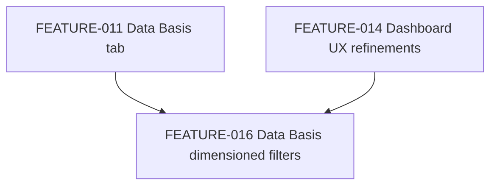

# FEATURE-016 — Data Basis: district/neighbourhood dimensions + population split for the remaining 4 charts

**Status:** 🔵 Planned · **Effort:** M (~11.5 h, reviewer estimate) · **Priority:** Medium
**Branch root:** `feature/data-basis-dimensioned-filters` · **Created:** 2026-07-19

> **Provenance:** this is a stub plan extracted verbatim from `@architect`'s original FEATURE-014
> Phase 5a/5b/5d content, split out by `@reviewer` during the FEATURE-014 review (see
> [REVIEW-FEATURE-014.md](../reviews/REVIEW-FEATURE-014.md)) because it was, by a wide margin, the
> largest and highest-regression-risk slice of that plan. It has **not** yet been through its own
> full architect/reviewer pass — treat this as a scoped starting point, not an approved technical
> plan. There is no `dev/plans/technical/FEATURE-016-technical-plan.yaml` yet.
>
> **Numbering note:** FEATURE-015 was not available for this follow-up — it is already occupied by
> stray, untracked idealista-web-scraper placeholder files from an unrelated session
> (`dev/plans/FEATURE-015-idealista-web-scraper.md`, `dev/plans/technical/FEATURE-015-technical-plan.yaml`,
> `dev/reviews/REVIEW-FEATURE-015.md` — confirmed via `git status`/`git ls-files`). Do not touch those
> files; this feature is correctly FEATURE-016.

## Objective

Extend district/neighbourhood filtering to the 4 Data Basis charts that FEATURE-014 left unfiltered
(`weekly-listing-volume`, `size-histogram`, `rooms-distribution`, `price-per-area-histogram-{rent,sale}`),
and add a population (`general`/`relevant`) split for the Data Basis tab, matching what FEATURE-014
already did for `listing-locations-map` and for Trend Analysis.

## Dependencies

- Requires [FEATURE-014](FEATURE-014-dashboard-ux-refinements.md) (shared filter-bar hoisted above
  both Trend Analysis and Data Basis, `renderDataBasisTab()` scoping wired for `listing-locations-map`).
- Builds on FEATURE-011 (Data Basis tab).

## Scope (carried over from the FEATURE-014 architect plan, Phase 5a/5b/5d)

**Backend — add district/neighbourhood dimensions to the 4 undimensioned Data Basis datasets:**

1. `src/etl/data_processing/gold_aggregate.py`: add `"district"` (and, where meaningful,
   `"neighborhood"`) to the `groupby()` keys of `weekly_listing_volume()`, `size_histogram_10sqm()`,
   `rooms_distribution()`, `price_per_area_histogram()`. Existing field names/semantics (`operation`,
   `bin_start_m2`, `rooms`, etc.) are unchanged; `district`/`neighborhood` are additive columns.
   Golden-master fixture(s) in `src/etl/data_processing/tests/test_gold_golden_master.py` and any
   `test_gold_aggregator.py` assertions that pattern-match the full record shape of these 4 datasets
   need updating to include the new fields.
2. `src/etl/data_processing/gold_aggregator.py`: no `Aggregation` class signature changes needed (the
   4 strategies still delegate to the same helper names) — verify `WeeklyListingVolume`,
   `SizeHistogram10sqm`, `RoomsDistribution`, `PricePerAreaHistogram` docstrings/comments still match
   behaviour.

**Backend — additive `data_basis_relevant` population split:**

1. `GoldAggregator.build_document()`: add `"data_basis_relevant":
   self._run_data_basis(_relevant_rows(scoped), self._data_basis)` alongside the existing unfiltered
   `"data_basis"` key. Keep `"data_basis"`'s current (unfiltered) meaning unchanged for backward
   compatibility with anything already consuming it (including FEATURE-014's `listing-locations-map`
   scoping, which must keep working against unfiltered `data_basis`).
2. Update `src/etl/data_processing/tests/test_gold_aggregator.py` / golden-master fixtures for the new
   top-level key.
3. `documentation/DATA_GOLD_LAYER.md`: document the new `data_basis_relevant` key and the new
   `district`/`neighborhood` fields on the 4 datasets.

**Frontend — wire population selection + scope-aware re-aggregation into the 4 renderers:**

1. `renderDataBasisTab()` in `frontend/app.js`: select `cachedData[activePopulation === 'relevant' ?
   'data_basis_relevant' : 'data_basis']` for these 4 renderers (in addition to the
   `listing-locations-map` scoping FEATURE-014 already wired), and apply `applyScope()` before
   rendering.
2. `frontend/src/charts/weekly_listing_volume.js`, `size_histogram.js`, `rooms_distribution.js`,
   `price_per_area_histogram.js`: each gains a small private re-aggregation step: after
   `filterPopulationBlock()`/`applyScope()` narrows rows to the selected scope, the renderer
   re-`groupby`-sums `count_listings` back down to its original bin grain (`operation` + bin/x-value),
   because adding a district dimension to the backend groupby produces more granular rows than the
   chart's bins expect. Keep `filters.js` itself untouched (Single Responsibility — it stays a
   generic row-filter, unaware of chart-specific re-aggregation); colocate the re-aggregation with
   the one renderer that needs it (Adapter between the newly-dimensioned gold data and each chart's
   existing bin-shaped contract).
3. Update the corresponding renderer unit tests (`frontend/tests/*.test.js` for the 4 files above) to
   cover: (a) unfiltered input behaves exactly as before (regression guard), (b) filtered input with
   multiple districts re-collapses to the same bin grain with correctly summed counts, (c) population
   toggle switches between `data_basis`/`data_basis_relevant` correctly.
4. Update `frontend/tests/app.test.js` for the full Data Basis scoping behaviour across all charts.

## Key risks to re-litigate at review time

- **Regression risk on golden-master fixtures:** these 4 datasets' fixtures are shared with other
  existing tests; adding columns must not silently change any currently-asserted value.
- **Re-aggregation correctness:** the "collapse rows back to bin grain" step in 4 separate renderers
  must exactly reproduce today's unfiltered totals — prime candidate for an off-by-one or
  double-counting bug; needs an explicit unfiltered-input-unchanged regression test per renderer
  before the filtered-input behaviour is trusted.
- **Consider consolidating the re-aggregation logic:** the reviewer of this plan should assess
  whether 4 near-identical private "collapse" functions constitute duplication that warrants a
  shared helper, versus keeping them separate (current FEATURE-014 convention favours one function
  per chart semantic to avoid over-engineering a one-off need) — decide during FEATURE-016's own
  review pass.

## Success criteria (to be re-confirmed/expanded during full review)

- [ ] `weekly-listing-volume`, `size-histogram`, `rooms-distribution`, and
      `price-per-area-histogram-{rent,sale}` all respect district/neighbourhood/population filtering
      on the Data Basis tab, with correctly re-aggregated totals.
- [ ] Existing unfiltered behaviour of all 4 charts is unchanged (regression guard).
- [ ] `data_basis` keeps its current unfiltered meaning; `data_basis_relevant` is additive.
- [ ] All backend (`pytest`) and frontend (`vitest`) tests pass; coverage >80% on new/changed code;
      `python dev/tools/validate_workflow.py` reports no new inconsistencies for FEATURE-016.

## Next step

This stub needs its own `@architect`/`@reviewer` pass (full risk assessment, golden-master fixture
review, and an executable `dev/plans/technical/FEATURE-016-technical-plan.yaml`) before
implementation — do not hand this directly to `@implementer`.
