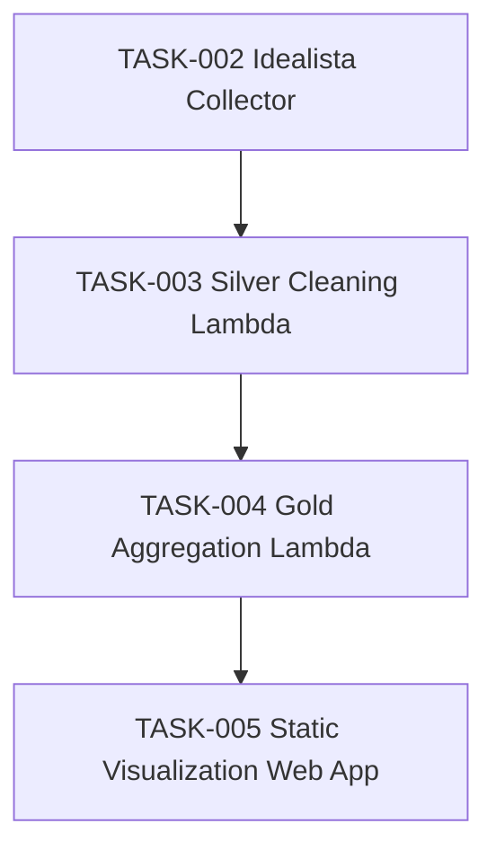

# Development Planning

This directory contains structured task plans generated by the Planner Agent.

## Overview
This planning system helps organize software development by breaking down complex work into manageable, version-controlled tasks.

## Task Status

| ID | Title | Status | Branch | Effort | Priority | Assignee |
|----|-------|--------|--------|--------|----------|----------|
| TASK-001 | Merge debug features into production | 🔵 | `feature/merge-debug-features` | 30 min | High | @coder |
| TASK-002 | Idealista Web Scraper — Notebook MVP + Lambda | 🟡 | `feature/idealista-web-scraper` | 4–5 days | High | @coder |
| TASK-003 | Silver Cleaning Lambda (Bronze → Silver cleaned listings) | 🟡 | `feature/silver-cleaning-lambda` | 1.5–2 days | High | Unassigned |
| TASK-004 | Gold Aggregation Lambda (Silver → Gold aggregations JSON) | 🔵 | `feature/gold-aggregation-lambda` | 1–1.5 days | High | Unassigned |
| TASK-005 | Static Visualization Web App (S3 + CloudFront) | 🔵 | `feature/static-visualization-webapp` | 1–1.5 days | Medium | Unassigned |

**Status Legend:**
- 🔵 Planned - Task defined, not started
- 🟡 In Progress - Active development
- 🟢 Complete - Merged to main
- 🔴 Blocked - Waiting on dependency or decision

## Current Sprint

**Sprint Goal:** [Define current focus]

**Active Tasks:**
- TASK-002 (Notebook MVP and scraper flow complete; remaining subtasks pending)

## Task Dependencies



## Completed Work
- [List completed tasks with links]

## Backlog
- [Future tasks not yet planned in detail]

## Branch Naming Convention
- `feature/task-name` - New features
- `bugfix/issue-description` - Bug fixes
- `refactor/component-name` - Code restructuring
- `docs/topic` - Documentation updates
- `test/component-name` - Test additions

## Workflow

1. **Plan:** Use `@planner` agent to discuss and create task plans
2. **Review:** Use `@reviewer` agent to critically evaluate the plan
3. **Refine:** Address reviewer feedback and update plan if needed
4. **Create Branch:** `git checkout -b feature/task-name`
5. **Implement:** Follow the task plan steps
6. **Test:** Complete all testing requirements
7. **Update Status:** Mark plan document with 🟡 or 🟢
8. **PR & Merge:** Create PR referencing task ID

### Quality Gate
All tasks should go through:
```
@planner → Plan Created → @reviewer → Approved → Implementation
```

### File Organization
- **Plans:** `dev/plans/TASK-XXX.md`
- **Reviews:** `dev/reviews/REVIEW-TASK-XXX.md`
- **Implementations:** `dev/plans/implementations/IMPLEMENTATION-TASK-XXX.md`

### Status Source Of Truth
- `dev/plans/technical/TASK-XXX-technical-plan.yaml` is authoritative for subtask progress.
- This README and each top-level task file should mirror aggregated technical-plan status.
- Run `python dev/tools/validate_agent_workflow.py` before opening a PR.

## Notes
- Each task should be independently testable
- Keep branches focused on single task scope
- Update this README when task status changes
- Link PRs to task documents in commit messages
