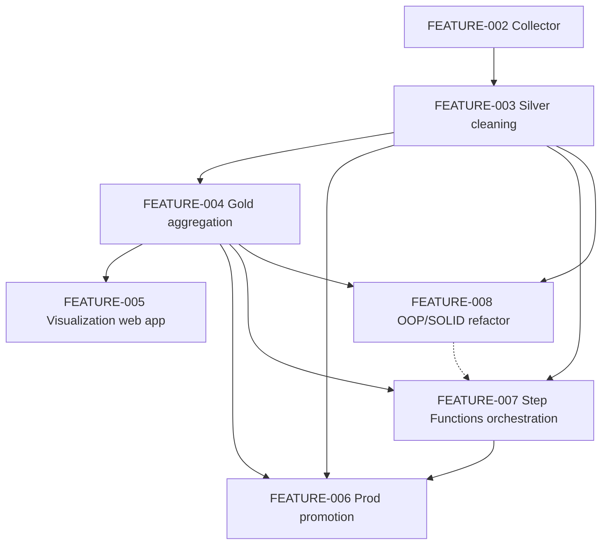

# Feature plans

Feature plans for this repository, produced by the **Architect · Review · Implement** workflow
(see [`.github/agents/WORKFLOW.md`](../../.github/agents/WORKFLOW.md)). Each feature is broken into
small, version-controlled, independently testable tasks.

## Features

| ID | Title | Status | Branch | Effort | Priority | Owner |
|----|-------|--------|--------|--------|----------|-------|
| FEATURE-002 | Idealista web scraper — OOP service on AWS Fargate | 🔵 | `feature/idealista-web-scraper` | 6–8 d | High | @implementer |
| FEATURE-003 | Silver cleaning Lambda (bronze → cleaned listings) | 🟢 | `feature/silver-cleaning-lambda` | 1.5–2 d | High | @implementer |
| FEATURE-004 | Gold aggregation Lambda (silver → aggregations JSON) | 🟢 | `feature/gold-aggregation-lambda` | 1–1.5 d | High | Unassigned |
| FEATURE-005 | Static visualization web app (S3 + CloudFront) | 🟢 | `feature/static-visualization-webapp` | 1.5–2 d | Medium | Unassigned |
| FEATURE-006 | Prod promotion: wire silver + gold lambdas in prod | 🔵 | `feature/prod-promotion-silver-gold` | ~2 h | High | Unassigned |
| FEATURE-007 | Step Functions orchestration (bronze → silver → gold) | 🔵 | `feature/step-functions-orchestration` | 12–16 h | Medium | Unassigned |
| FEATURE-008 | OOP/SOLID refactor of the ETL pipeline | 🔵 | `feature/oop-refactor-pipeline` | M (~1.5–2 d) | Medium | Unassigned |

**Status:** 🔵 planned · 🟡 in progress · 🟢 complete · 🔴 blocked

## Dependencies



## Workflow at a glance

1. **Architect** — `@architect <goal>` writes a plan here as `FEATURE-XXX-<slug>.md`.
2. **Review** — `@reviewer Review FEATURE-XXX` emits the review and the executable technical plan.
3. **Implement** — `@implementer Implement FEATURE-XXX` works the technical plan branch by branch.
4. **Ship** — push and open a PR referencing the feature ID.

## Where things live

- **Plans:** `dev/plans/FEATURE-XXX-<slug>.md`
- **Reviews:** `dev/reviews/REVIEW-FEATURE-XXX.md`
- **Technical plans (executable):** `dev/plans/technical/FEATURE-XXX-technical-plan.yaml`
- **Implementation notes (optional):** `dev/plans/implementations/`

## Status source of truth

The technical-plan YAML is authoritative for task progress. This README and each top-level feature
file mirror its aggregated status. Before opening a PR, run the consistency check:

```bash
python dev/tools/validate_workflow.py
```

## Branch naming

- `feature/<feature-slug>/<phase>.<step>-<desc>` — feature work (hierarchical, one branch per task)
- `bugfix/<desc>` · `refactor/<desc>` · `docs/<topic>` · `test/<desc>` — other changes
